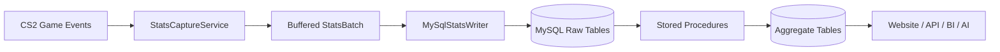

# CS2-STATPLAY

[](https://github.com/NeuTroNBZh/CS2-STATPLAY-clean/actions/workflows/release-package.yml)
[](https://github.com/NeuTroNBZh/CS2-STATPLAY-clean/actions/workflows/github-release.yml)
[](LICENSE)
[](https://docs.cssharp.dev/docs/guides/getting-started.html)

Production-oriented Counter-Strike 2 stats plugin for CounterStrikeSharp with MySQL persistence.

It captures, stores, and aggregates player/server data across three levels:

- global player lifetime
- per player session
- per map session

Two release variants are provided for safe operations:

- normal package (includes config) for first install
- update package (without config) for upgrades without overwriting credentials

## What It Collects

- playtime (session and lifetime)
- K/D/A
- headshots
- weapon fire counts
- grenade detonation stats (HE/Flash/Molotov/Smoke)
- objective stats (bomb plants and defuses)
- round MVP events
- connected players snapshots (count + player identity)
- detailed kill events and player action events
- map session and round lifecycle history

## How It Works



Main runtime components:

- `src/CS2Stats.Plugin/CS2StatsPlugin.cs`: plugin lifecycle, timers, flush orchestration
- `src/CS2Stats.Plugin/StatsCaptureService.cs`: event-to-contract capture and buffering
- `src/CS2Stats.Plugin/MySqlStatsWriter.cs`: transactional batch persistence
- `src/CS2Stats.Plugin/AggregationService.cs`: aggregate refresh strategy
- `sql/001_v1_baseline_schema.sql`: schema
- `sql/002_v1_aggregation_stored_procedures.sql`: aggregate refresh procedures

## Install

### 1) Requirements

- Counter-Strike 2 dedicated server
- MetaMod + CounterStrikeSharp correctly installed under `game/csgo/addons`
- MySQL 8+

### 2) Choose release package

- **Fresh install**: `CS2-STATPLAY-1.0.0-linux-x64.zip`
- **Update without overwriting config**: `CS2-STATPLAY-1.0.0-linux-x64-update-no-config.zip`

### 3) Extract and copy

Copy the package `addons/` folder into your server `game/csgo/` directory.

Expected final paths:

- `game/csgo/addons/counterstrikesharp/plugins/CS2Stats/CS2Stats.dll`
- `game/csgo/addons/counterstrikesharp/configs/plugins/CS2Stats/CS2Stats.json` (normal package only)

### 4) Configure MySQL

Edit the config file generated from `config/cs2stats.example.json`:

```json
{
  "mySql": {
    "host": "YOUR_HOST",
    "port": 3306,
    "database": "YOUR_DATABASE",
    "username": "YOUR_USER",
    "password": "YOUR_PASSWORD",
    "sslRequired": true
  },
  "modules": {
    "sessionTrackingEnabled": true,
    "kdaEnabled": true,
    "headshotEnabled": true,
    "weaponFireEnabled": true,
    "grenadeStatsEnabled": true,
    "objectiveStatsEnabled": true,
    "presenceSnapshotsEnabled": true,
    "matchHistoryEnabled": false
  },
  "sync": {
    "flushIntervalSeconds": 15,
    "presenceSnapshotIntervalSeconds": 10,
    "maxBufferedEvents": 5000
  }
}
```

### 5) Initialize database schema

Run:

```sql
SOURCE sql/001_v1_baseline_schema.sql;
SOURCE sql/002_v1_aggregation_stored_procedures.sql;
```

Restart the server and verify the plugin is loaded with `css_plugins list`.

## Update Flow (Safe)

Use `...-update-no-config.zip` for production updates.

It updates binaries only and does not include `CS2Stats.json`, so your database credentials stay untouched.

## Data For Web/API/AI

The complete table-by-table guide is in:

- `docs/STATS_DATA_REFERENCE.md`

It includes:

- every table name and field purpose
- table grain and relationships
- practical SQL query examples
- website/API integration patterns
- reuse ideas for analytics and AI agents

## Local Development

```powershell
dotnet restore CSStat.sln
dotnet build CSStat.sln
dotnet test CSStat.sln
```

Generate release packages locally:

```powershell
./scripts/package-release.ps1 -Configuration Release -Version 1.0.0 -PackageId CS2-STATPLAY -RuntimeIdentifier linux-x64
```

## Release 1.0.0

Tag `v1.0.0` produces:

- `CS2-STATPLAY-1.0.0-linux-x64.zip`
- `CS2-STATPLAY-1.0.0-linux-x64-update-no-config.zip`
- `SHA256SUMS.txt`

## Contribution, Security, License

- Contribution guide: `CONTRIBUTING.md`
- Security policy: `SECURITY.md`
- License: `LICENSE` (MIT)
