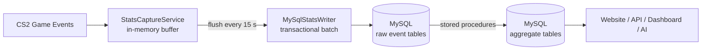

# CS2-STATPLAY

[](https://github.com/NeuTroNBZh/CS2-STATPLAY/releases/latest)
[](https://github.com/NeuTroNBZh/CS2-STATPLAY/actions/workflows/release-package.yml)
[](LICENSE)
[](https://docs.cssharp.dev)
[](https://www.mysql.com)

Production-ready Counter-Strike 2 stats plugin for [CounterStrikeSharp](https://docs.cssharp.dev). Captures every game event in real time, persists it to MySQL, and aggregates it at three granularity levels: **lifetime**, **session**, and **per map**.

---

## Table of Contents

- [Features](#features)
- [How It Works](#how-it-works)
- [Requirements](#requirements)
- [Installation](#installation)
- [Configuration](#configuration)
- [In-Game Commands](#in-game-commands)
- [Database Schema](#database-schema)
- [Updating](#updating)
- [Multi-Server Setup](#multi-server-setup)
- [Webhook Milestones](#webhook-milestones)
- [Local Development](#local-development)
- [Contributing](#contributing)

---

## Features

| Category | What is tracked |
|---|---|
| **Sessions** | Player connect / disconnect with playtime |
| **Rounds** | Round start, end, duration, winning team |
| **Kills** | K/D/A, headshot, hitgroup, weapon, distance, damage (health + armor) |
| **Grenades** | HE, flashbang, molotov, smoke detonations |
| **Objectives** | Bomb plants, bomb defuses, round MVP, hostage rescues/kills |
| **Presence** | Connected player count snapshots (configurable interval) |
| **Aggregates** | Lifetime stats, per-session stats, per-map stats via stored procedures |

**v1.1.0 additions**

- `!stats`, `!rank`, `!top` in-game chat commands
- Player display name stored and updated on each connect
- `winner_team` on every round
- Hostage events table (`hostage_rescued`, `hostage_killed`)
- Versioned schema migrations — zero manual `ALTER TABLE` on upgrades
- Multi-server support — each server tracked independently
- Milestone webhook — HTTP POST when a player crosses a kill threshold

---

## How It Works


```mermaid
flowchart LR
    A[CS2 Game Events] --> B[StatsCaptureService\nin-memory buffer]
    B -->|flush every 15 s| C[MySqlStatsWriter\ntransactional batch]
    C --> D[(MySQL\nraw event tables)]
    D -->|stored procedures| E[(MySQL\naggregate tables)]
    E --> F[Website / API / Dashboard / AI]
```

**Key components**

| File | Role |
|---|---|
| `CS2StatsPlugin.cs` | Plugin lifecycle, timers, flush orchestration, exponential-backoff reconnect |
| `StatsCaptureService.cs` | Converts CS2 game events to typed contracts, buffers them in memory |
| `MySqlStatsWriter.cs` | Drains the buffer into MySQL inside a single transaction per flush |
| `DatabaseInitializationService.cs` | Auto-creates database, tables, and applies versioned migrations on startup |
| `AggregationService.cs` | Calls stored procedures to refresh aggregate tables after each flush |
| `StatsCommandService.cs` | Powers the `!stats`, `!rank`, `!top` chat commands |
| `MilestoneWebhookService.cs` | Fires HTTP POST webhooks when players reach kill milestones |

---

## Requirements

- Counter-Strike 2 dedicated server (Linux x64)
- [MetaMod:Source](https://www.metamodsource.net) installed
- [CounterStrikeSharp](https://docs.cssharp.dev/docs/guides/getting-started.html) installed
- MySQL 8+ (or MariaDB 10.5+)

---

## Installation

### 1. Create the MySQL database and user

```sql
CREATE DATABASE cs2_stats CHARACTER SET utf8mb4 COLLATE utf8mb4_unicode_ci;
CREATE USER 'cs2stats'@'%' IDENTIFIED BY 'your-secure-password';
GRANT ALL PRIVILEGES ON cs2_stats.* TO 'cs2stats'@'%';
FLUSH PRIVILEGES;
```

> The plugin auto-creates all tables and applies migrations on first start. No manual SQL import needed.

### 2. Download the release package

Go to [Releases](https://github.com/NeuTroNBZh/CS2-STATPLAY/releases/latest) and download:

- **`CS2-STATPLAY-x.x.x-linux-x64.zip`** — full install (includes default config)
- **`CS2-STATPLAY-x.x.x-linux-x64-update-no-config.zip`** — update only (preserves your existing config)

### 3. Extract to your server

```bash
# From your game/csgo/ directory
unzip CS2-STATPLAY-x.x.x-linux-x64.zip
```

Final paths after extraction:

```
game/csgo/addons/counterstrikesharp/plugins/CS2Stats/CS2Stats.dll
game/csgo/addons/counterstrikesharp/configs/plugins/CS2Stats/CS2Stats.json
```

### 4. Edit the config file

Edit `game/csgo/addons/counterstrikesharp/configs/plugins/CS2Stats/CS2Stats.json` with your MySQL credentials (see [Configuration](#configuration)).

### 5. Start the server

On startup the plugin will:
1. Connect to MySQL
2. Create the database if it does not exist
3. Create all tables
4. Apply any pending schema migrations
5. Start capturing events

Verify the plugin loaded with `css_plugins list` in the server console.

---

## Configuration

Full reference for `CS2Stats.json`:

```json
{
  "server": {
    "name": "my-server-1"
  },
  "mySql": {
    "host": "127.0.0.1",
    "port": 3306,
    "database": "cs2_stats",
    "username": "cs2stats",
    "password": "your-password",
    "sslRequired": false
  },
  "modules": {
    "sessionTrackingEnabled": true,
    "kdaEnabled": true,
    "weaponFireEnabled": true,
    "grenadeStatsEnabled": true,
    "objectiveStatsEnabled": true,
    "presenceSnapshotsEnabled": true
  },
  "sync": {
    "flushIntervalSeconds": 15,
    "presenceSnapshotIntervalSeconds": 10,
    "maxBufferedEvents": 5000
  },
  "webhook": {
    "url": "",
    "killsMilestone": 100
  }
}
```

### Field reference

**`server`**

| Field | Default | Description |
|---|---|---|
| `name` | `"default"` | Identifier stored in the `servers` table. Use a unique name per server when running multiple instances against the same database. |

**`mySql`**

| Field | Default | Description |
|---|---|---|
| `host` | `"127.0.0.1"` | MySQL host |
| `port` | `3306` | MySQL port |
| `database` | `"cs2_stats"` | Database name (auto-created if the user has `CREATE` privilege) |
| `username` | `"cs2stats"` | MySQL user |
| `password` | `"change-me"` | MySQL password |
| `sslRequired` | `false` | Enforce TLS for the MySQL connection |

**`modules`** — set any field to `false` to stop collecting that category of data

| Field | Default | Description |
|---|---|---|
| `sessionTrackingEnabled` | `true` | Player connect / disconnect sessions |
| `kdaEnabled` | `true` | Kill / death / assist events |
| `weaponFireEnabled` | `true` | Weapon fire counts |
| `grenadeStatsEnabled` | `true` | Grenade detonations |
| `objectiveStatsEnabled` | `true` | Bomb, MVP, hostage events |
| `presenceSnapshotsEnabled` | `true` | Periodic connected player count snapshots |

**`sync`**

| Field | Default | Description |
|---|---|---|
| `flushIntervalSeconds` | `15` | How often the in-memory buffer is written to MySQL |
| `presenceSnapshotIntervalSeconds` | `10` | How often a presence snapshot is captured |
| `maxBufferedEvents` | `5000` | Maximum events held in memory before new events are dropped |

**`webhook`**

| Field | Default | Description |
|---|---|---|
| `url` | `""` | HTTP(S) endpoint to POST to. Leave empty to disable. |
| `killsMilestone` | `100` | Fire a webhook every time a player's in-session kill count crosses a multiple of this value (100, 200, 300…) |

---

## In-Game Commands

Players type these in chat (the `!` prefix is handled automatically by CounterStrikeSharp).

| Command | Description |
|---|---|
| `!stats` | Your own stats: K/D/A, HS%, ADR, MVPs, playtime |
| `!stats <name>` | Stats for any currently online player (partial name, case-insensitive) |
| `!rank` | Your global kill ranking among all tracked players |
| `!top` | Top 5 players by total kills |

---

## Database Schema

The plugin manages two layers of tables automatically.

### Raw event tables

Written directly by the plugin on each flush.

| Table | Description |
|---|---|
| `players` | One row per Steam account. Stores `steam_id64` and `display_name`. |
| `servers` | One row per unique `server.name`. |
| `map_sessions` | One row per map load, linked to a server. |
| `player_sessions` | Connect / disconnect record per player per map session. |
| `rounds` | Round start / end with duration and `winner_team`. |
| `kill_events` | Full kill detail: weapon, hitgroup, damage, flags (HS / noscope / blind…). |
| `player_action_events` | Weapon fire, grenades, bomb plants/defuses, MVP — typed action rows. |
| `hostage_events` | Hostage rescues and kills with player and round context. |
| `presence_snapshots` | Periodic snapshots of connected player count. |
| `schema_migrations` | Tracks applied migrations (internal — do not modify). |

### Aggregate tables

Refreshed automatically by stored procedures after each flush.

| Table | Description |
|---|---|
| `player_lifetime_stats` | Cumulative totals per player across all sessions. |
| `player_session_stats` | Totals per player per connection session. |
| `player_map_stats` | Totals per player per map session. |

You can also call the stored procedures directly:

```sql
-- Refresh all players
CALL sp_refresh_player_lifetime_stats(NULL);

-- Refresh a specific player (player_id = 42)
CALL sp_refresh_player_lifetime_stats(42);

-- Refresh a specific session
CALL sp_refresh_player_session_stats(7);

-- Refresh a specific player on a specific map session
CALL sp_refresh_player_map_stats(42, 3);
```

For a complete field-by-field reference with example queries, see [`docs/STATS_DATA_REFERENCE.md`](docs/STATS_DATA_REFERENCE.md).

---

## Updating

Always use the **`-update-no-config`** package when upgrading an existing installation. It replaces the plugin binary without touching your `CS2Stats.json`.

```bash
unzip CS2-STATPLAY-x.x.x-linux-x64-update-no-config.zip
```

Schema migrations are applied automatically on the next server start — no manual SQL needed.

---

## Multi-Server Setup

Point multiple game servers at the same MySQL database and set a **unique `server.name`** in each config:

```json
// Server 1 — competitive
{ "server": { "name": "eu-competitive-1" } }

// Server 2 — deathmatch
{ "server": { "name": "eu-deathmatch-1" } }
```

Each server gets its own row in the `servers` table. All `map_sessions` carry a `server_id` foreign key, so you can filter or aggregate stats per server in SQL.

---

## Webhook Milestones

When `webhook.url` is set, the plugin sends an HTTP POST every time a player's kill count (tracked since server start) crosses a multiple of `webhook.killsMilestone`.

**Example payload**

```json
{
  "event": "milestone",
  "server": "my-server-1",
  "steamId64": "76561198000000001",
  "playerName": "PlayerName",
  "milestone": "kills",
  "value": 100,
  "timestamp": "2025-06-09T14:32:00Z"
}
```

The request is fire-and-forget and never blocks the game thread. Network errors are logged as warnings and do not affect plugin operation. Leave `url` empty to disable this feature entirely.

---

## Local Development

### Build and test

```powershell
dotnet restore CSStat.sln
dotnet build CSStat.sln
dotnet test CSStat.sln
```

### Generate release packages locally

```powershell
./scripts/package-release.ps1 `
  -Configuration Release `
  -Version 1.1.0 `
  -PackageId CS2-STATPLAY `
  -RuntimeIdentifier linux-x64
```

Output:

```
artifacts/
  CS2-STATPLAY-1.1.0-linux-x64.zip
  CS2-STATPLAY-1.1.0-linux-x64-update-no-config.zip
  SHA256SUMS.txt
```

### Project structure

```
CSStat.sln
├── src/
│   ├── CS2Stats.Contracts/       # Shared event records and config types
│   ├── CS2Stats.Plugin/          # Plugin, writer, capture, commands, webhook
│   └── CS2Stats.Tests/           # Unit tests (xUnit)
├── sql/                          # Baseline schema and stored procedures
├── config/                       # Example config file
├── scripts/                      # Release packaging script
└── docs/                         # Data reference and architecture notes
```

---

## Contributing

See [CONTRIBUTING.md](CONTRIBUTING.md) for guidelines.  
Security issues: see [SECURITY.md](SECURITY.md).  
License: [MIT](LICENSE).
